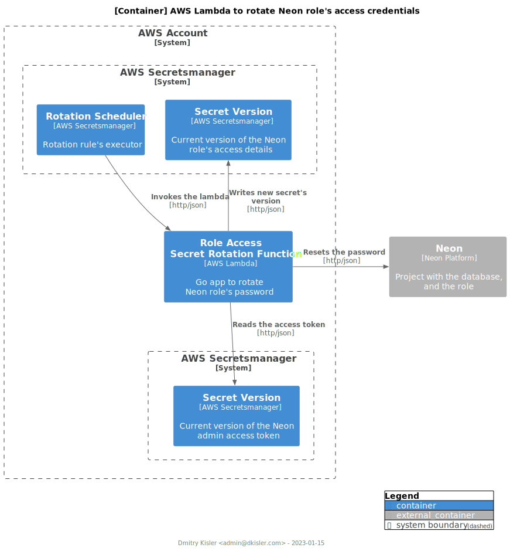

# AWS Lambda to rotate Secret in AWS Secretsmanager

[](https://goreportcard.com/report/github.com/kislerdm/aws-lambda-secret-rotation)
[](https://codecov.io/github/kislerdm/aws-lambda-secret-rotation)

AWS Lambda function
to [rotate](https://docs.aws.amazon.com/secretsmanager/latest/userguide/rotating-secrets.html) secret's version, e.g.
database access credentials, stored in [AWS Secretsmanager](https://aws.amazon.com/secrets-manager/).

## How it works

<figure style="alignment: center;">

<figcaption style="alignment: center;">[C4 Container] Architecture Diagram.</figcaption>
</figure>

The diagram illustrates the process of secret's rotation.

Upon invocation, the AWS Lambda's logic executes the
following [steps](https://docs.aws.amazon.com/secretsmanager/latest/userguide/rotate-secrets_turn-on-for-other.html#rotate-secrets_turn-on-for-other_step5):

1. _Create Secret_: new version of the "Secret User" secret is generated and stored in the staging label _AWSPENDING_;
2. _Set Secret_: newly generated secret's version is set in the "System deleted Access Management";
3. _Test Secret_: newly generated secret's version is tested against the "System deleted Access Management";
4. _Finish Secret_: newly generated secret's version is moved from the stage _AWSPENDING_ to _AWSCURRENT_.

**Note** that the secret is expected to be JSON-encoded.

### The Lambda Module

The AWS Lambda's logic defined in the Go module is encapsulated in two interfaces:

- `SecretsmanagerClient`: defines communication with the secrets vault, i.e. AWS Secretsmanager;
- `ServiceClient`: defines communication with the system which credentials are stored in the vault. The interface's
  methods define the logic to perform the rotation steps 1-3. The client uses the secret "_Secret Admin_" to pass
  authentication and authorization in order to reset the credentials "_Secret User_".

The AWS Lambda handler is defined as the function `Start` configured with the object of the type `Config`. The config
includes the following attributes:

- Clients, i.e. instances of `SecretsmanagerClient` and `ServiceClient`;
- `SecretObj`: the type defining the structure of the secret "Secret User";
- `Debug`: flag to activate debug level logs.

#### Plugins

The lambda module defines the interfaces and abstract methods only. The implementation for specific "System delegated
Credentials Store" is done as a plugin which defines the signatures of `ServiceClient` according to the system's specs.
Every plugin is distributed as a separate Go module.

#### List of Plugins

- [neon](plugin/neon): plugin to change role's password in the [Neon](https://neon.tech/) SaaS Postgres service

#### Plugin Codebase Structure

Every plugin is stored in the directory [`plugin`](plugin).

It is recommended to use the template to develop and distribute plugin's codebase:

```commandline
.
|-- README.md
|-- go.mod                <- Definition of Go module: github.com/kislerdm/aws-lambda-secret-rotation/plugin/{{.PluginName}}
|-- go.sum
|-- models.go             <- Types defining structure of "Secret User" and "Secret Admin"         
|-- serviceclient.go      <- Implementation of `ServiceClient` interface
|-- serviceclient_test.go
`-- cmd
    `-- lambda
        `-- main.go       <- AWS Lambda handler's definition
```

## Contribution

The codebase is distributed under the [MIT license](LICENSE). Please feel free to open an issue ticket, or PR to
contribute.

## Development

### Requirements

- [go](https://go.dev) ~> 1.19
- [gnuMake](https://www.gnu.org/software/make/)

### Commands

Run to see available commands:

```commandline
make help
```

Run to test the `lambda` module:

```commandline
make tests
```

Run to test a plugin module:

```commandline
make test-plugin PLUGIN=##name-of-the-plugin##
```

For example, to run unit tests for the Neon plugin:

```commandline
make test-plugin PLUGIN=neon
```

Run to build lambda binary for selected plugin:

```commandline
make build PLUGIN=##name-of-the-plugin##
```

For example, to run unit tests for the Neon plugin:

```commandline
make build PLUGIN=neon
```
