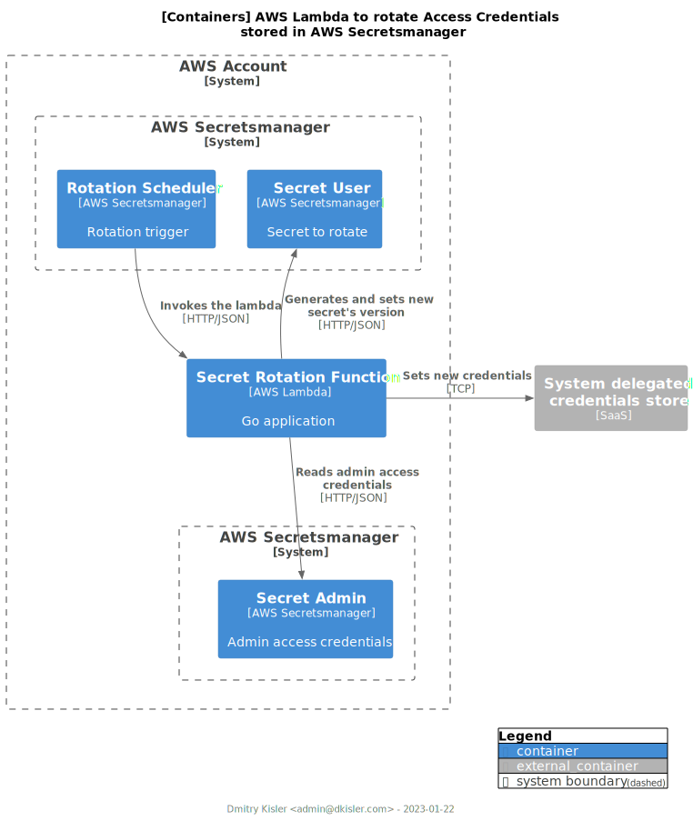

# AWS Lambda to rotate Secret in AWS Secretsmanager

AWS Lambda function
to [rotate](https://docs.aws.amazon.com/secretsmanager/latest/userguide/rotating-secrets.html) secret's version, e.g.
database access credentials, stored in [AWS Secretsmanager](https://aws.amazon.com/secrets-manager/).

## How it works

<figure style="alignment: center;">

<figcaption style="alignment: center;">[C4 Container] Architecture Diagram.</figcaption>
</figure>

The diagram illustrates the process of secret's rotation.

Upon invocation, the AWS Lambda's logic executes the
following [steps](https://docs.aws.amazon.com/secretsmanager/latest/userguide/rotate-secrets_turn-on-for-other.html#rotate-secrets_turn-on-for-other_step5):

1. _Create Secret_: new version of the "Secret User" secret is generated and stored in the staging label _AWSPENDING_;
2. _Set Secret_: newly generated secret's version is set in the "System deleted Access Management";
3. _Test Secret_: newly generated secret's version is tested against the "System deleted Access Management";
4. _Finish Secret_: newly generated secret's version is moved from the stage _AWSPENDING_ to _AWSCURRENT_.

**Note** that the secret is expected to be JSON-encoded.

The logic is encapsulated in two interfaces:

- `SecretsmanagerClient`: defines communication with the secrets vault, i.e. AWS Secretsmanager;
- `ServiceClient`: defines communication with the system which credentials are stored in the vault. The interface's
  methods define the logic to perform the rotation steps 1-3. The client uses the secret "_Secret Admin_" to pass
  authentication and authorization in order to reset the credentials "_Secret User_".

The AWS Lambda handler is defined as the function `Start` configured with the object of the type `Config`. The config
includes the following attributes: 
- Clients, i.e. instances of `SecretsmanagerClient` and `ServiceClient`;
- `SecretObj`: the type defining the structure of the secret "Secret User";
- `Debug`: flag to activate debug level logs.

## Contribution

The codebase is distributed under the [MIT license](LICENSE). Please feel free to open an issue ticket, or PR to
contribute.

## Development

### Requirements

- [go](https://go.dev) ~> 1.19
- [gnuMake](https://www.gnu.org/software/make/)

### Commands

Run to see available commands:

```commandline
make help
```

Run to test the `lambda` module:

```commandline
make tests
```

Run to test a plugin module:

```commandline
make test-plugin PLUGIN=##name-of-the-plugin##
```

For example, to run unit tests for the Neon plugin:

```commandline
make test-plugin PLUGIN=neon
```

Run to build lambda binary for selected plugin:

```commandline
make build PLUGIN=##name-of-the-plugin##
```

For example, to run unit tests for the Neon plugin:

```commandline
make build PLUGIN=neon
```
